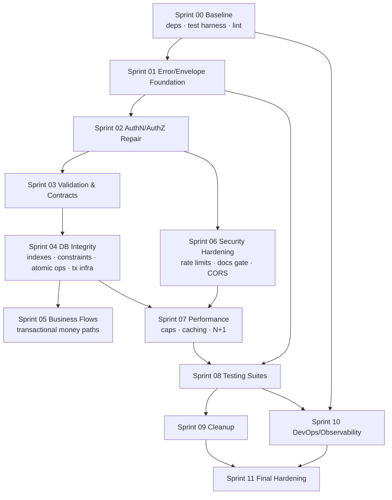
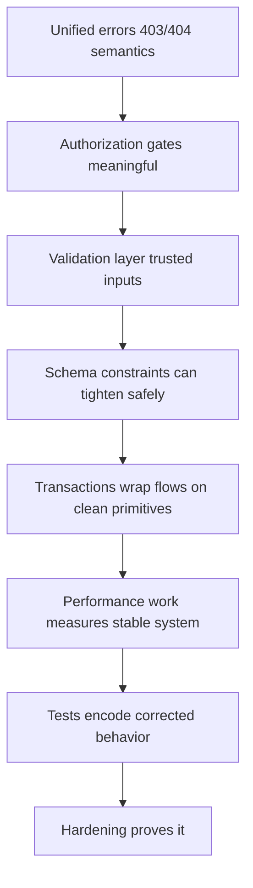

# Dependency & Delivery Graph

## Sprint dependency chain

## Conceptual fix-dependency chain (why the order)

Authentication precedes dependent authorization work (Sprint 02 internal order:
SEC-01 → AUTH-01 role model → ACL gates → token lifecycle). Authorization precedes
business-logic hardening because flows assume callers are already correctly gated.

## Code-level dependencies introduced

- `lib/errors.js` (Sprint 01) ← used by every later sprint.
- `validations/` canonical module (Sprint 03) ← routes, and bounds reused by schema tasks.
- `utils/dbUtils.withTransaction` hardened (Sprint 04) ← Sprint 05 flows.
- Shared paginate helper (Sprint 07) ← replaces per-service ad hoc parsing.
- Logger + security-event helper (Sprint 10) ← consumed retroactively by auth events.
